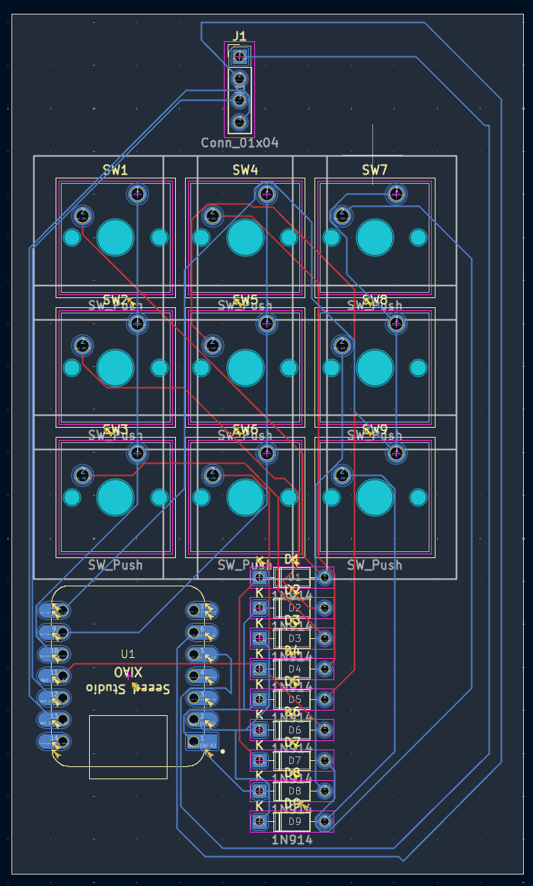
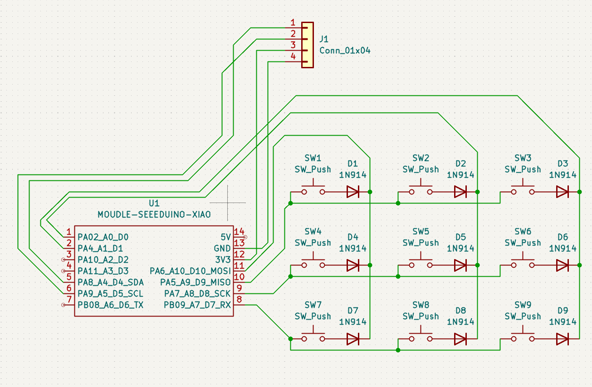

# Hackpad

A custom 9-key macropad in a 3×3 layout, built around a Seeed Studio XIAO (SAMD21). Each switch has its own diode, wired as a 3×3 key matrix, and the board drives a small OLED display. 

  

## Features

- 9 mechanical (MX-style) keys in a 3×3 grid, fully diode-isolated matrix
- Seeed Studio XIAO (SAMD21) as the controller — small footprint, native USB
- SSD1306 OLED display (128×32, I²C) for status text
- Custom KiCad PCB
- Custom enclosure modeled in Fusion 360, with cutouts for USB-C and the display header
- Firmware based on [KMK](https://github.com/KMKfw/kmk_firmware) (CircuitPython)

## Repository structure

| Folder | Contents |
| --- | --- |
| `Assets/` | Renders/photos used in this README (schematic, PCB, case) |
| `CAD/` | 3D assembly model (`Assembly1.0.step`) |
| `Firmware/` | `code.py` (KMK firmware source) and a compiled `.hex` build |
| `pcb/` | KiCad project (schematic + PCB layout, `.kicad_pro/.kicad_sch/.kicad_pcb`) |
| `Production/` | Manufacturing-ready files: case top/bottom (`.step`) and PCB `gerbers.zip` |

## Hardware

### Schematic

  

The controller is a **Seeed Studio XIAO (SAMD21)**. The 9 switches form a 3×3 diode matrix and a 4-pin header standard 2.54 mm pitch, GND–VCC–SCL–SDA) 

### PCB

  

Designed in **KiCad** (see `pcb/`). Manufacturing files (gerbers) are in `Production/gerbers.zip`.

### Case

  

Modeled in **Fusion 360**. The case holds the PCB in a recess, with a cutout for the XIAO's USB-C port and an opening for the 4-pin display header. STEP files for the top and bottom shells are in `Production/`, and the full assembly is in `CAD/Assembly1.0.step`.

### Bill of Materials

| Part | Quantity |
| --- | --- |
| Seeed Studio XIAO | 1 |
| MX-style switches | 9 |
| 1N914 diodes | 9 |
| SSD1306 OLED display (128×32, I²C) | 1 |
| 4-pin header | 1 |
| M3 screws | 4 |

## Firmware

Firmware lives in `Firmware/` and is written for [KMK](https://github.com/KMKfw/kmk_firmware), a CircuitPython-based keyboard firmware. `code.py` is the source; a compiled `.hex` build is included as well.

What it does:
- Defines a 3×3 key matrix on `board.D0–D2` (columns) and `board.D7–D9` (rows), `COL2ROW` diode orientation
- Maps the 9 keys to the numpad keys `7 8 9 / 4 5 6 / 1 2 3`
- Drives an SSD1306 OLED over I²C to show status text ("Hackpad" / "9 Tasten")

